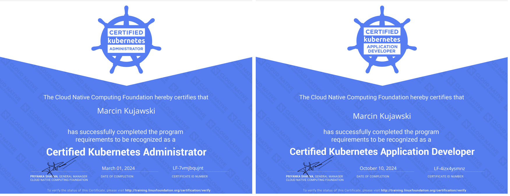

# How I passed CKA Exam



## About the CKA EXAM

- CKA Exam Page: https://training.linuxfoundation.org/certification/certified-kubernetes-administrator-cka/
- Read the important tips: https://docs.linuxfoundation.org/tc-docs/certification/tips-cka-and-ckad
- Read the FAQ: https://docs.linuxfoundation.org/tc-docs/certification/faq-cka-ckad
- Open Book Exam - Allowed to use the Documentation
- Around 17 Questions to solve in 120 mins
- Questions don’t have weightage anymore
- You get 2 retakes
- Passing Score is 66%

## Resources
- Kubernetes official Doc:
  - https://kubernetes.io/docs
  - https://kubernetes.io/blog
  - https://helm.sh/docs
- Killer Coda Scenarios: https://killercoda.com/playgrounds/scenario/cka
- Killer.sh Practice test: https://killer.sh/cka

## Tips and Tricks
- Familiarize yourself with the documentation, you need to know exactly what to find and where it is located in docs
- BE FAST!
- Use IMPERATIVE commands to create resources instead of creating them from manifest files
- Copy paste everything you can
- Read & Understand the Questions before answering
- Always validate after you are done - recheck before moving to the next question

## Must Know Topics
1. Etcd Backup & Restore
2. Cluster Upgrade
3. PV and PVC
4. Network Pplicies
5. Ingress
6. Service Accounts, Role, RoleBindings
7. Services
8. Logs and Events for Pods/Deployments
9. Contexts, custom filtering, metrics

## Must Know Commands
Aliases:
```
export k="kubectl"
export dr="--dry-run=client -o yaml"
export now="--grace-period=0 --force"
```
1. Formatting
```
kubectl get pods -A --sort-by=metadata.creationTimestamp
kubectl get pods -A --sort-by=metadata.creationTimestamp --no-headers |tac
kubectl get pods pod1 -o jsonpath="{.spec.nodeName}"
kubectl get pods -o jsonpath="{range .items[*]} {.metadata.name}{.spec.containers[*].resources}{'\n'}"
kubectl get pods pod1 -o jsonpath="{range .items[*]}{.metadata.name} {.status.qosClass}{'\n'}"
```
2. Certificates
```
openssl x509 --noout --text -in /var/lib/kubelet/pki/kubelet.crt
kubeadm certs check-expiration
kubeadm certs renew apiserver
```
3. Pods
```
kubectl run pod1 --image nginx --labels="id=cross-server-ready,app=dev"
kubectl run secret-pod -n secret --image=busybox1.31.1 -- sh -c sleep 1d
kubectl get pod --show-labels
kubectl apply -f pod.yaml
kubectl replace -f pod.yaml --force
```
4. Deployments and Rolling Update
```
kubectl create deployment web01 --image nginx=nginx:1.17 --replicas 3
kubectl scale deployment web01 --replicas 5
kubectl set image deployment web01 nginx=nginx:1.17 --record
kubectl rollout history deployment web01
kubectl exec -it pod1 -c container1 -- printenv | grep APP
```
5. Nodes
```
kubectl describe node worker1 | grep -i taint
kubectl top node
kubectl top pods --containers
kubectl get node -o custom-columns=NAME:.metadata.name,AVAILABLE_MEMORY:.status.allocatable.memory,AVAILABLE_CPU:.status.allocatable.cpu
kubeadm token create --print-join-command
kubeadm token list
```
6. Services
```
kubectl expose pod pod1 --name nginx-service --port 80
kubectl expose deployment web01 --name web-service --type=NodePort --port 80
```
7. Contexts
```
kubectl config view
kubectl config get-contexts
kubectl config get-contexts -o name > /opt/course/1/contexts
kubectl config current-context
cat ~/.kube/config | grep -i current-context | cut -d ":" -f2
```
8. Scheduling
```
kubectl cordon worker02
kubectl drain worker02 --ignore-daemonsets --delete-emptydir-data
```
9. RBAC
```
kubectl create sa gitops -n project1
kubectl create role -n project1 gitops-role --verb=create --resource=secrets,configmap
kubectl create rolebinding -n project1 gitops-rolebinding --role=gitops-role --serviceaccount=project1:gitops
kubectl -n project1 auth can-i create pod --as system:serviceaccount:project1:gitops
kubectl -n project1 auth can-i create secrets --as system:serviceaccount:project1:gitops
kubectl -n project1 auth can-i create configmap --as system:serviceaccount:project1:gitops
```
10. Troubleshooting
```
crictl ps
crictl logs <container-id>
crictl ps | grep <pattern>
crictl inspect 1e020b43c4423
crictl rm 1e020b43c4423
crictl inspect <container-id> | grep -i runtimeType
ssh worker1 ‘crictl inspect <container-id> | grep -i runtimeType’
cd /var/log/pods
cd /var/log/containers
cd /etc/kubernetes/manifests/
journalctl | grep apiserver
cd /etc/cni/net.d/                                              # network plugin path
systemctl status kubelet
systemctl restart kubelet
whereis kubelet
vi /etc/system/system/kubelet.service.d/10-kubeadm.conf         # kubelet service file
cat /etc/kubernetes/kubelet.conf                                # kubelet config file
cd /var/lib/kubelet/pki                                         # certs for kubelet
```
11.	Logs and Events
```
kubectl logs deployments/web001 -c container1
kubectl get events -A --sort-by=".metadata.creationTimestamp"
```
